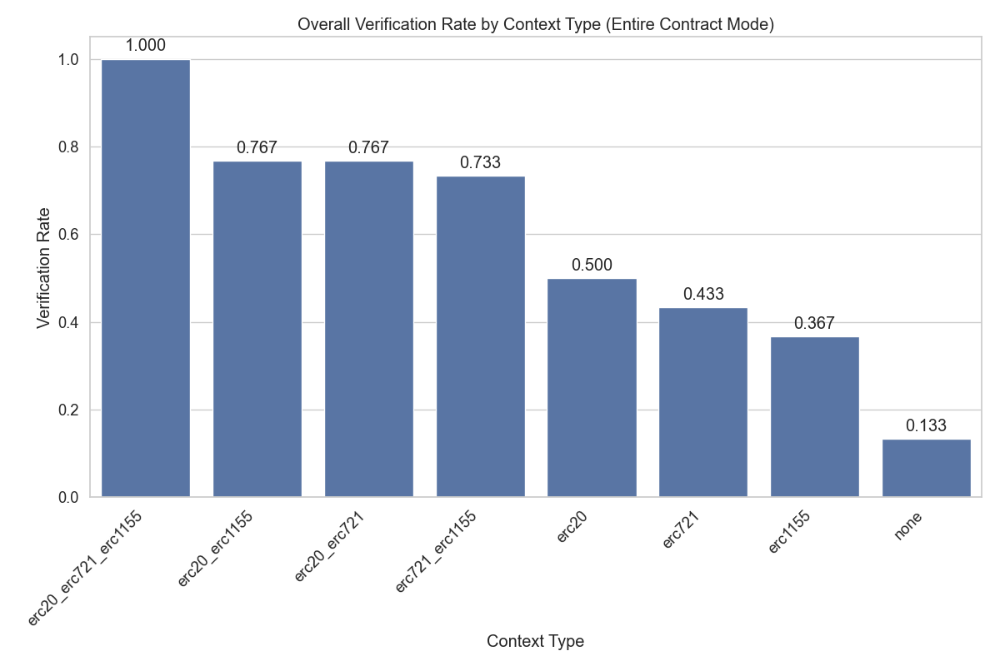

# Context Enhancement Performance Analysis for ERC1155 (Entire Contract Mode)

This document analyzes context enhancement strategies for formal postcondition generation in smart contracts. Analysis based on 80 total runs.

## Overall Performance Analysis

Success rates for generating postconditions that pass formal verification.

**Total Runs Analyzed:** 80

| context_type         | verification_rate | verified_count | total_runs | avg_time           | avg_iterations |
| :------------------- | :---------------- | :------------- | :--------- | :----------------- | :------------- |
| erc20_erc721_erc1155 | 100.00            | 10             | 10         | 67.38982698917388  | 0.5            |
| erc721_erc1155       | 100.00            | 10             | 10         | 78.49783952236176  | 0.6            |
| erc20_erc1155        | 90.00             | 9              | 10         | 158.28276958465577 | 2.6            |
| erc1155              | 80.00             | 8              | 10         | 218.93863186836242 | 3.6            |
| erc20_erc721         | 40.00             | 4              | 10         | 300.93873727321625 | 7.2            |
| erc721               | 10.00             | 1              | 10         | 312.891521859169   | 9.2            |
| erc20                | 0.00              | 0              | 10         | 258.2753127336502  | 10.0           |
| none                 | 0.00              | 0              | 10         | 305.8131155014038  | 10.0           |

**Key Observations:**

- Best performing context: 'erc20_erc721_erc1155' with 100.00% success rate
- Average success rate: 52.50%
- Lowest performing context: 'none' with 0.00% success rate

## Efficiency Analysis

Analysis of iterations and time required for successful vs failed verification attempts.

| context_type         | avg_fail_iterations | avg_success_iterations | avg_fail_time      | avg_success_time   | fail_rate |
| :------------------- | :------------------ | :--------------------- | :----------------- | :----------------- | :-------- |
| erc20                | 10.0                | 0.0                    | 258.2753127336502  | 0.0                | 100.00    |
| none                 | 10.0                | 0.0                    | 305.8131155014038  | 0.0                | 100.00    |
| erc721               | 10.0                | 2.0                    | 337.7327916622162  | 89.32009363174438  | 90.00     |
| erc20_erc721         | 10.0                | 3.0                    | 388.35942578315735 | 169.8077045083046  | 60.00     |
| erc1155              | 10.0                | 2.0                    | 526.7936615943909  | 141.97487443685532 | 20.00     |
| erc20_erc1155        | 10.0                | 1.7777777777777777     | 437.89095878601074 | 127.21519300672743 | 10.00     |
| erc20_erc721_erc1155 | 0.0                 | 0.5                    | 0.0                | 67.38982698917388  | 0.00      |
| erc721_erc1155       | 0.0                 | 0.6                    | 0.0                | 78.49783952236176  | 0.00      |

## Function-level Verification Analysis

Analysis of which specific smart contract functions are most successfully verified.

## Conclusions and Recommendations

**Key Findings:**

1. Top performing contexts: `erc20_erc721_erc1155`, `erc721_erc1155`, `erc20_erc1155`
2. Base model without context: 0.00%

_Report generated on 2025-08-21 22:50:02_
