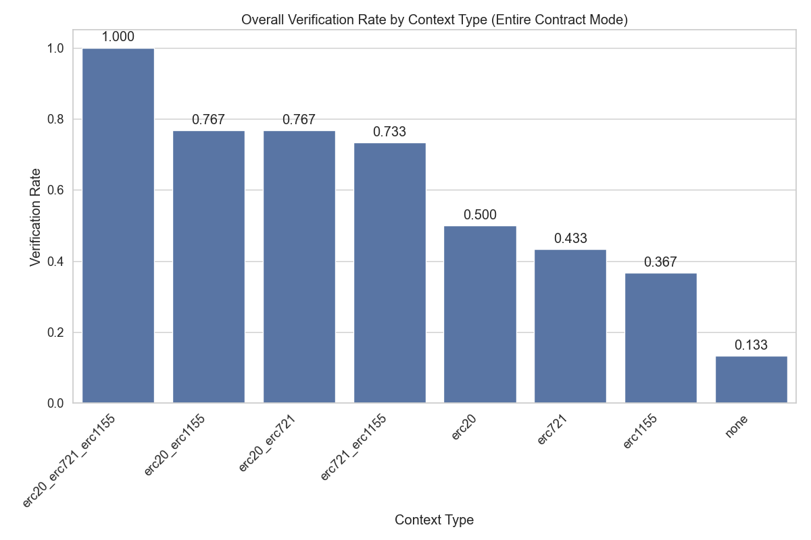

# Context Enhancement Performance Analysis for ERC20 (Entire Contract Mode)

This document analyzes context enhancement strategies for formal postcondition generation in smart contracts. Analysis based on 80 total runs.

## Overall Performance Analysis

Success rates for generating postconditions that pass formal verification.

**Total Runs Analyzed:** 80

| context_type | verification_rate | verified_count | total_runs | avg_time | avg_iterations |
| :--- | :--- | :--- | :--- | :--- | :--- |
| erc20 | 100.00 | 10 | 10 | 49.42599835395813 | 0.0 |
| erc20_erc1155 | 100.00 | 10 | 10 | 48.20305738449097 | 0.0 |
| erc20_erc721_erc1155 | 100.00 | 10 | 10 | 49.18901426792145 | 0.0 |
| erc20_erc721 | 90.00 | 9 | 10 | 92.98166460990906 | 1.7 |
| none | 40.00 | 4 | 10 | 244.71547586917876 | 6.5 |
| erc1155 | 20.00 | 2 | 10 | 338.2265253782272 | 9.0 |
| erc721 | 20.00 | 2 | 10 | 304.75759127140043 | 8.7 |
| erc721_erc1155 | 20.00 | 2 | 10 | 307.5795832157135 | 8.4 |

**Key Observations:**

- Best performing context: 'erc20' with 100.00% success rate
- Average success rate: 61.25%
- Lowest performing context: 'erc721_erc1155' with 20.00% success rate

## Efficiency Analysis

Analysis of iterations and time required for successful vs failed verification attempts.

| context_type | avg_fail_iterations | avg_success_iterations | avg_fail_time | avg_success_time | fail_rate |
| :--- | :--- | :--- | :--- | :--- | :--- |
| erc1155 | 10.0 | 5.0 | 366.542159229517 | 224.96398997306824 | 80.00 |
| erc721 | 10.0 | 3.5 | 342.8571130335331 | 152.35950422286987 | 80.00 |
| erc721_erc1155 | 10.0 | 2.0 | 361.93625420331955 | 90.1528992652893 | 80.00 |
| none | 10.0 | 1.25 | 356.2705870072047 | 77.38280916213989 | 60.00 |
| erc20_erc721 | 10.0 | 0.7777777777777778 | 338.78507900238037 | 65.67017412185669 | 10.00 |
| erc20 | 0.0 | 0.0 | 0.0 | 49.42599835395813 | 0.00 |
| erc20_erc1155 | 0.0 | 0.0 | 0.0 | 48.20305738449097 | 0.00 |
| erc20_erc721_erc1155 | 0.0 | 0.0 | 0.0 | 49.18901426792145 | 0.00 |

## Function-level Verification Analysis

Analysis of which specific smart contract functions are most successfully verified.

## Conclusions and Recommendations

**Key Findings:**

1. Top performing contexts: `erc20`, `erc20_erc1155`, `erc20_erc721_erc1155`
2. Base model without context: 40.00%
3. Context enhancement improvement: 150.0% over no context

*Report generated on 2025-08-21 22:45:21*
