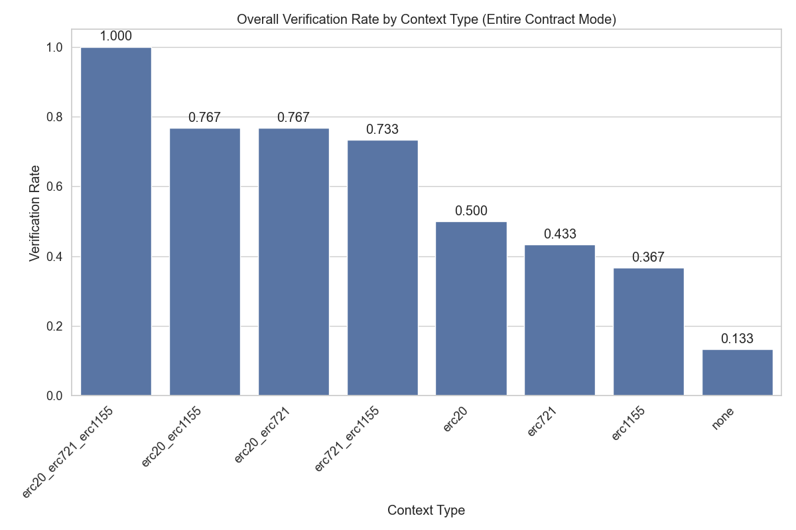

# Context Enhancement Performance Analysis for ERC721 (Entire Contract Mode)

This document analyzes context enhancement strategies for formal postcondition generation in smart contracts. Analysis based on 80 total runs.

## Overall Performance Analysis

Success rates for generating postconditions that pass formal verification.

**Total Runs Analyzed:** 80

| context_type | verification_rate | verified_count | total_runs | avg_time | avg_iterations |
| :--- | :--- | :--- | :--- | :--- | :--- |
| erc20_erc721 | 100.00 | 10 | 10 | 58.98359668254852 | 0.0 |
| erc20_erc721_erc1155 | 100.00 | 10 | 10 | 61.728886127471924 | 0.0 |
| erc721 | 100.00 | 10 | 10 | 66.94229228496552 | 0.0 |
| erc721_erc1155 | 100.00 | 10 | 10 | 63.7291178226471 | 0.0 |
| erc20 | 50.00 | 5 | 10 | 250.00493495464326 | 6.9 |
| erc20_erc1155 | 40.00 | 4 | 10 | 379.2119453191757 | 7.0 |
| erc1155 | 10.00 | 1 | 10 | 532.2626229763031 | 9.5 |
| none | 0.00 | 0 | 10 | 499.57099611759185 | 10.0 |

**Key Observations:**

- Best performing context: 'erc20_erc721' with 100.00% success rate
- Average success rate: 62.50%
- Lowest performing context: 'none' with 0.00% success rate

## Efficiency Analysis

Analysis of iterations and time required for successful vs failed verification attempts.

| context_type | avg_fail_iterations | avg_success_iterations | avg_fail_time | avg_success_time | fail_rate |
| :--- | :--- | :--- | :--- | :--- | :--- |
| none | 10.0 | 0.0 | 499.57099611759185 | 0.0 | 100.00 |
| erc1155 | 10.0 | 5.0 | 550.165346092648 | 371.1381149291992 | 90.00 |
| erc20_erc1155 | 10.0 | 2.5 | 497.53433843453723 | 201.72835564613342 | 60.00 |
| erc20 | 10.0 | 3.8 | 385.24416279792786 | 114.76570711135864 | 50.00 |
| erc20_erc721 | 0.0 | 0.0 | 0.0 | 58.98359668254852 | 0.00 |
| erc20_erc721_erc1155 | 0.0 | 0.0 | 0.0 | 61.728886127471924 | 0.00 |
| erc721 | 0.0 | 0.0 | 0.0 | 66.94229228496552 | 0.00 |
| erc721_erc1155 | 0.0 | 0.0 | 0.0 | 63.7291178226471 | 0.00 |

## Function-level Verification Analysis

Analysis of which specific smart contract functions are most successfully verified.

## Conclusions and Recommendations

**Key Findings:**

1. Top performing contexts: `erc20_erc721`, `erc20_erc721_erc1155`, `erc721`
2. Base model without context: 0.00%

*Report generated on 2025-08-21 22:49:44*
