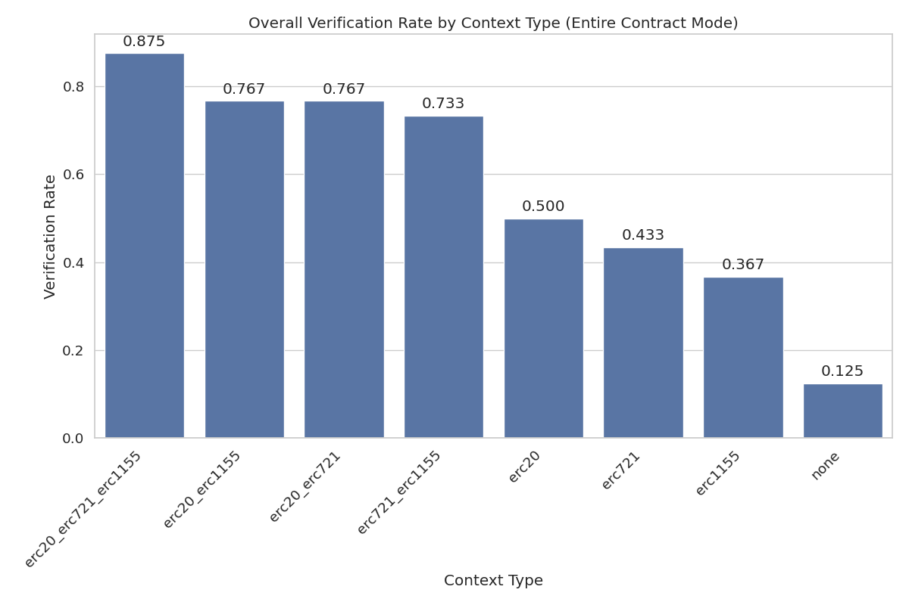

# Context Enhancement Performance Analysis for ERC7683 (Entire Contract Mode)

This document analyzes context enhancement strategies for formal postcondition generation in smart contracts. Analysis based on 20 total runs.

## Overall Performance Analysis

Success rates for generating postconditions that pass formal verification.

**Total Runs Analyzed:** 20

| context_type         | verification_rate | verified_count | total_runs | avg_time           | avg_iterations |
| :------------------- | :---------------- | :------------- | :--------- | :----------------- | :------------- |
| erc20_erc721_erc1155 | 50.00             | 5              | 10         | 196.23077495098113 | 5.5            |
| none                 | 10.00             | 1              | 10         | 357.12248811721804 | 9.2            |

**Key Observations:**

- Best performing context: 'erc20_erc721_erc1155' with 50.00% success rate
- Average success rate: 30.00%
- Lowest performing context: 'none' with 10.00% success rate

## Efficiency Analysis

Analysis of iterations and time required for successful vs failed verification attempts.

| context_type         | avg_fail_iterations | avg_success_iterations | avg_fail_time      | avg_success_time  | fail_rate |
| :------------------- | :------------------ | :--------------------- | :----------------- | :---------------- | :-------- |
| none                 | 10.0                | 2.0                    | 369.0777956644694  | 249.5247201919556 | 90.00     |
| erc20_erc721_erc1155 | 10.0                | 1.0                    | 303.59297051429746 | 88.8685793876648  | 50.00     |

## Function-level Verification Analysis

Analysis of which specific smart contract functions are most successfully verified.

## Conclusions and Recommendations

**Key Findings:**

1. Top performing contexts: `erc20_erc721_erc1155`, `none`
2. Base model without context: 10.00%
3. Context enhancement improvement: 400.0% over no context

_Report generated on 2025-10-29 10:40:59_
