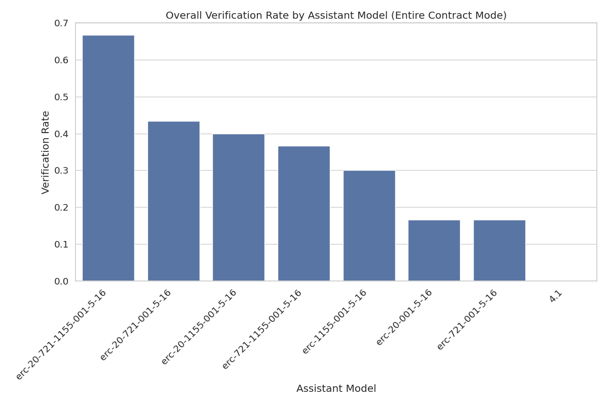

# Assistant Fine-Tuning Performance Analysis for ERC1155 (Entire Contract Mode)

This document analyzes fine-tuning experiments for formal postcondition generation in smart contracts. Analysis based on 70 total runs.

## Overall Performance Analysis

Success rates for generating postconditions that pass formal verification.

**Total Runs Analyzed:** 70

| model | verification_rate | verified_count | total_runs |
| :--- | :--- | :--- | :--- |
| erc-20-721-1155-001-5-16 | 70.00 | 7 | 10 |
| erc-20-1155-001-5-16 | 60.00 | 6 | 10 |
| erc-1155-001-5-16 | 50.00 | 5 | 10 |
| erc-721-1155-001-5-16 | 50.00 | 5 | 10 |
| erc-20-721-001-5-16 | 30.00 | 3 | 10 |
| erc-20-001-5-16 | 10.00 | 1 | 10 |
| erc-721-001-5-16 | 10.00 | 1 | 10 |

**Key Observations:**

- Best performing model: 'erc-20-721-1155-001-5-16' with 70.00% success rate
- Average success rate: 40.00%
- Lowest performing model: 'erc-721-001-5-16' with 10.00% success rate

## Efficiency Analysis

Analysis of iterations and time required for successful vs failed verification attempts.

| model | avg_fail_iterations | avg_success_iterations | avg_fail_time | avg_success_time | fail_rate |
| :--- | :--- | :--- | :--- | :--- | :--- |
| erc-20-001-5-16 | 10.0 | 6.0 | 506.8208063973321 | 337.18719458580017 | 90.00 |
| erc-721-001-5-16 | 10.0 | 1.0 | 303.4327322906918 | 155.34373307228088 | 90.00 |
| erc-20-721-001-5-16 | 10.0 | 1.6666666666666667 | 477.40826289994374 | 128.38063486417136 | 70.00 |
| erc-1155-001-5-16 | 10.0 | 0.4 | 332.8495099544525 | 72.63426847457886 | 50.00 |
| erc-721-1155-001-5-16 | 10.0 | 1.8 | 475.6532118320465 | 188.09829206466674 | 50.00 |
| erc-20-1155-001-5-16 | 10.0 | 2.6666666666666665 | 544.839805483818 | 169.74025563398996 | 40.00 |
| erc-20-721-1155-001-5-16 | 10.0 | 2.142857142857143 | 421.9002103805542 | 144.10592917033605 | 30.00 |

## Function-level Verification Analysis

Analysis of which specific smart contract functions are most successfully verified.

## Conclusions and Recommendations

**Key Findings:**

1. Top performing models: `erc-20-721-1155-001-5-16`, `erc-20-1155-001-5-16`, `erc-1155-001-5-16`
3. Successful verifications are faster than failed attempts, indicating early success predictors

*Report generated on 2025-07-18 21:12:45*
