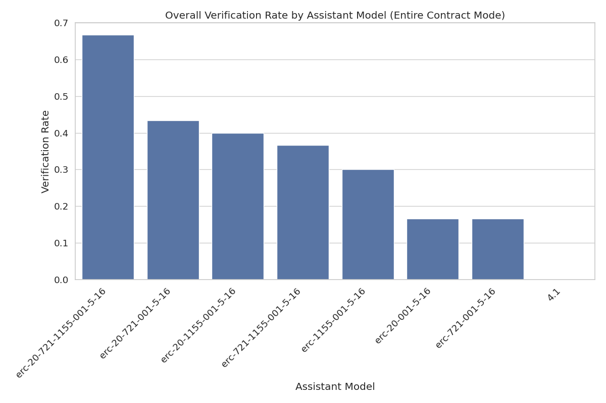

# Assistant Fine-Tuning Performance Analysis for ERC20 (Entire Contract Mode)

This document analyzes fine-tuning experiments for formal postcondition generation in smart contracts. Analysis based on 70 total runs.

## Overall Performance Analysis

Success rates for generating postconditions that pass formal verification.

**Total Runs Analyzed:** 70

| model                    | verification_rate | verified_count | total_runs |
| :----------------------- | :---------------- | :------------- | :--------- |
| erc-20-721-001-5-16      | 60.00             | 6              | 10         |
| erc-20-721-1155-001-5-16 | 60.00             | 6              | 10         |
| erc-20-1155-001-5-16     | 40.00             | 4              | 10         |
| erc-20-001-5-16          | 30.00             | 3              | 10         |
| erc-1155-001-5-16        | 20.00             | 2              | 10         |
| erc-721-1155-001-5-16    | 20.00             | 2              | 10         |
| erc-721-001-5-16         | 10.00             | 1              | 10         |

**Key Observations:**

- Best performing model: 'erc-20-721-001-5-16' with 60.00% success rate
- Average success rate: 34.29%
- Lowest performing model: 'erc-721-001-5-16' with 10.00% success rate

## Efficiency Analysis

Analysis of iterations and time required for successful vs failed verification attempts.

| model                    | avg_fail_iterations | avg_success_iterations | avg_fail_time      | avg_success_time   | fail_rate |
| :----------------------- | :------------------ | :--------------------- | :----------------- | :----------------- | :-------- |
| erc-721-001-5-16         | 10.0                | 5.0                    | 349.1401873164707  | 218.0040946006775  | 90.00     |
| erc-1155-001-5-16        | 10.0                | 2.0                    | 398.04571345448494 | 102.33528399467468 | 80.00     |
| erc-721-1155-001-5-16    | 10.0                | 2.0                    | 387.6471814215183  | 75.06930124759674  | 80.00     |
| erc-20-001-5-16          | 9.714285714285714   | 6.0                    | 363.6509395667485  | 310.71320637067157 | 70.00     |
| erc-20-1155-001-5-16     | 10.0                | 3.0                    | 405.3091236750285  | 107.63814753293991 | 60.00     |
| erc-20-721-001-5-16      | 10.0                | 2.0                    | 429.52357321977615 | 130.090238849322   | 40.00     |
| erc-20-721-1155-001-5-16 | 10.0                | 1.8333333333333333     | 430.45418697595596 | 129.4873057603836  | 40.00     |

## Function-level Verification Analysis

Analysis of which specific smart contract functions are most successfully verified.

## Conclusions and Recommendations

**Key Findings:**

1. Top performing models: `erc-20-721-001-5-16`, `erc-20-721-1155-001-5-16`, `erc-20-1155-001-5-16`
2. Successful verifications are faster than failed attempts, indicating early success predictors

_Report generated on 2025-07-18 21:12:44_
