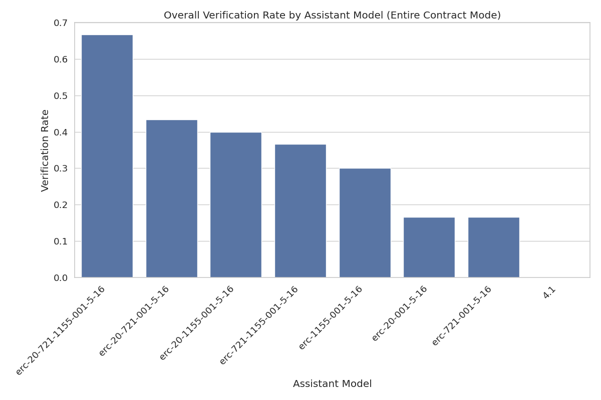

# Assistant Fine-Tuning Performance Analysis for ERC721 (Entire Contract Mode)

This document analyzes fine-tuning experiments for formal postcondition generation in smart contracts. Analysis based on 70 total runs.

## Overall Performance Analysis

Success rates for generating postconditions that pass formal verification.

**Total Runs Analyzed:** 70

| model | verification_rate | verified_count | total_runs |
| :--- | :--- | :--- | :--- |
| erc-20-721-1155-001-5-16 | 70.00 | 7 | 10 |
| erc-20-721-001-5-16 | 40.00 | 4 | 10 |
| erc-721-1155-001-5-16 | 40.00 | 4 | 10 |
| erc-721-001-5-16 | 30.00 | 3 | 10 |
| erc-1155-001-5-16 | 20.00 | 2 | 10 |
| erc-20-1155-001-5-16 | 20.00 | 2 | 10 |
| erc-20-001-5-16 | 10.00 | 1 | 10 |

**Key Observations:**

- Best performing model: 'erc-20-721-1155-001-5-16' with 70.00% success rate
- Average success rate: 32.86%
- Lowest performing model: 'erc-20-001-5-16' with 10.00% success rate

## Efficiency Analysis

Analysis of iterations and time required for successful vs failed verification attempts.

| model | avg_fail_iterations | avg_success_iterations | avg_fail_time | avg_success_time | fail_rate |
| :--- | :--- | :--- | :--- | :--- | :--- |
| erc-20-001-5-16 | 10.0 | 2.0 | 187.10688418812222 | 73.07129645347595 | 90.00 |
| erc-1155-001-5-16 | 10.0 | 1.0 | 210.65259543061256 | 46.402827978134155 | 80.00 |
| erc-20-1155-001-5-16 | 10.0 | 1.5 | 275.0335201025009 | 77.3932876586914 | 80.00 |
| erc-721-001-5-16 | 10.0 | 4.666666666666667 | 258.13634511402677 | 133.05058407783508 | 70.00 |
| erc-20-721-001-5-16 | 10.0 | 4.0 | 243.00563077131906 | 91.61183297634125 | 60.00 |
| erc-721-1155-001-5-16 | 10.0 | 4.25 | 305.00940175851184 | 170.95049273967743 | 60.00 |
| erc-20-721-1155-001-5-16 | 10.0 | 3.5714285714285716 | 375.38852246602374 | 131.1944670336587 | 30.00 |

## Function-level Verification Analysis

Analysis of which specific smart contract functions are most successfully verified.

## Conclusions and Recommendations

**Key Findings:**

1. Top performing models: `erc-20-721-1155-001-5-16`, `erc-20-721-001-5-16`, `erc-721-1155-001-5-16`
3. Successful verifications are faster than failed attempts, indicating early success predictors

*Report generated on 2025-07-18 21:12:45*
