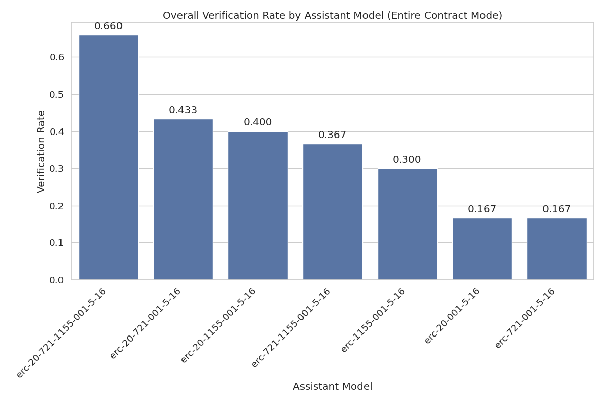

# Assistant Fine-Tuning Performance Analysis for ERC7683 (Entire Contract Mode)

This document analyzes fine-tuning experiments for formal postcondition generation in smart contracts. Analysis based on 20 total runs.

## Overall Performance Analysis

Success rates for generating postconditions that pass formal verification.

**Total Runs Analyzed:** 20

| model                    | context_type         | verification_rate | verified_count | total_runs | avg_time           | avg_iterations |
| :----------------------- | :------------------- | :---------------- | :------------- | :--------- | :----------------- | :------------- |
| erc-20-721-1155-001-5-16 | erc20_erc721_erc1155 | 70.00             | 7              | 10         | 181.47527096271514 | 3.6            |
| erc-20-721-1155-001-5-16 | none                 | 60.00             | 6              | 10         | 259.94808437824247 | 5.1            |

**Key Observations:**

- Best performing configuration: Model 'erc-20-721-1155-001-5-16' with context 'erc20_erc721_erc1155' (70.00% success rate)
- Average success rate: 65.00%
- Lowest performing configuration: Model 'erc-20-721-1155-001-5-16' with context 'none' (60.00% success rate)

## Efficiency Analysis

Analysis of iterations and time required for successful vs failed verification attempts.

| model                    | context_type         | avg_fail_iterations | avg_success_iterations | avg_fail_time      | avg_success_time   | fail_rate |
| :----------------------- | :------------------- | :------------------ | :--------------------- | :----------------- | :----------------- | :-------- |
| erc-20-721-1155-001-5-16 | none                 | 10.0                | 1.8333333333333333     | 453.04052609205246 | 131.21978990236917 | 40.00     |
| erc-20-721-1155-001-5-16 | erc20_erc721_erc1155 | 10.0                | 0.8571428571428571     | 376.8677611351013  | 97.7356323174068   | 30.00     |

## Function-level Verification Analysis

Analysis of which specific smart contract functions are most successfully verified.

## Conclusions and Recommendations

**Key Findings:**

1. Top performing configurations: `erc-20-721-1155-001-5-16` (context: `erc20_erc721_erc1155`), `erc-20-721-1155-001-5-16` (context: `none`)
2. Average without context: 60.00%
3. Average with context: 70.00%
4. Context enhancement improvement: 16.7% over no context

_Report generated on 2025-10-29 10:46:49_
