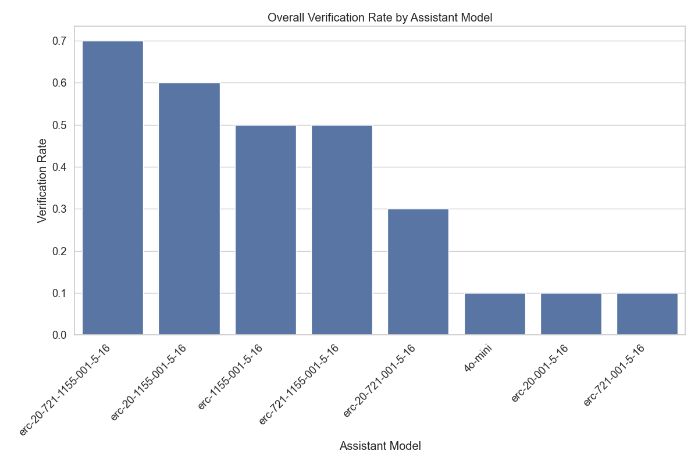
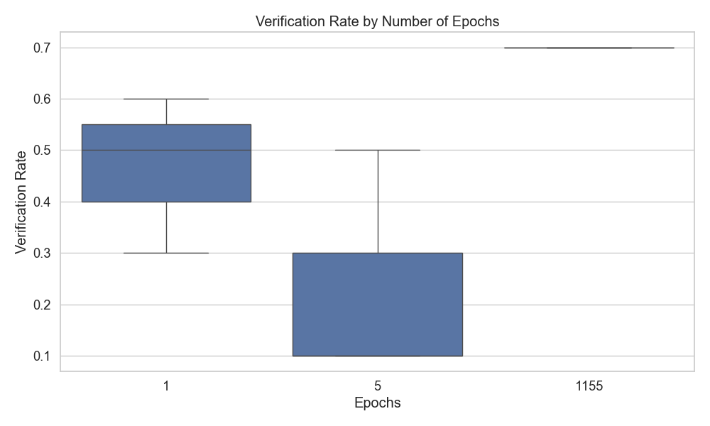
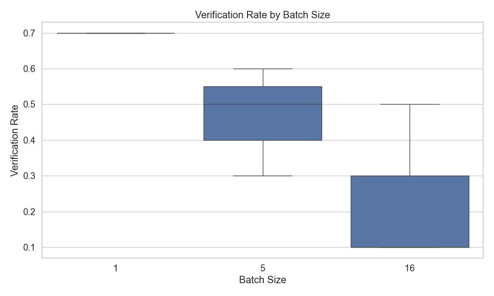

# Assistant Performance Comparison Report

## Summary Table

See [summary_table.csv](summary_table.csv) for the detailed metrics.

## Overall Verification Rates

## Verification Rates by Hyperparameters

### By Learning Rate

### By Epochs

### By Batch Size

For a more detailed analysis, see [Detailed Report](detailed_report.md).
