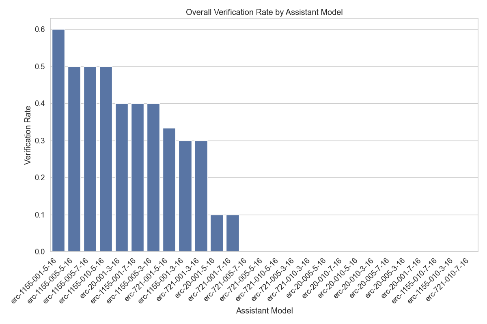
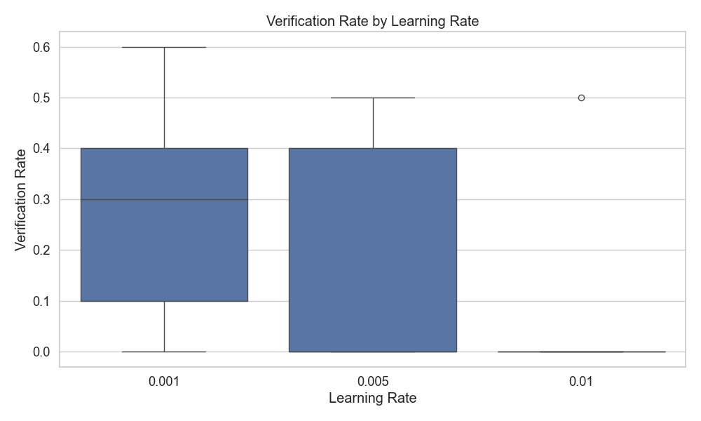
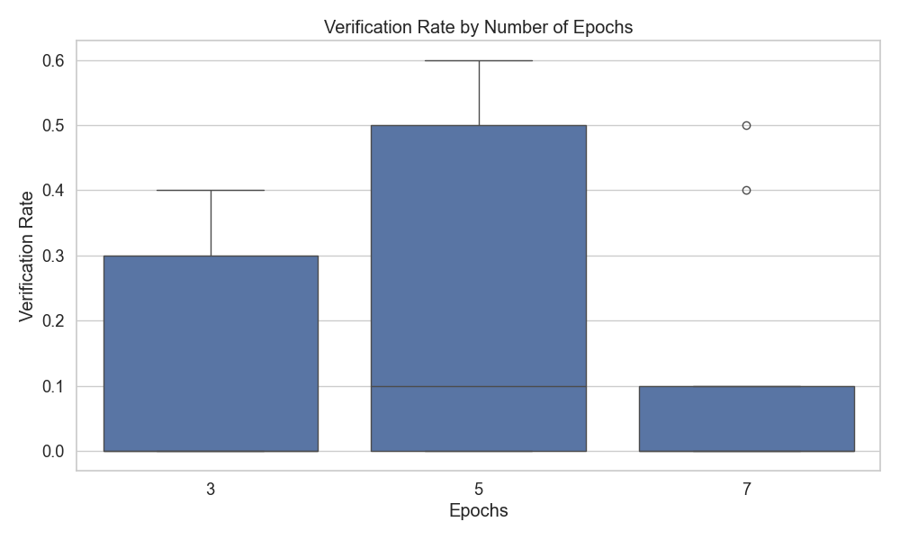
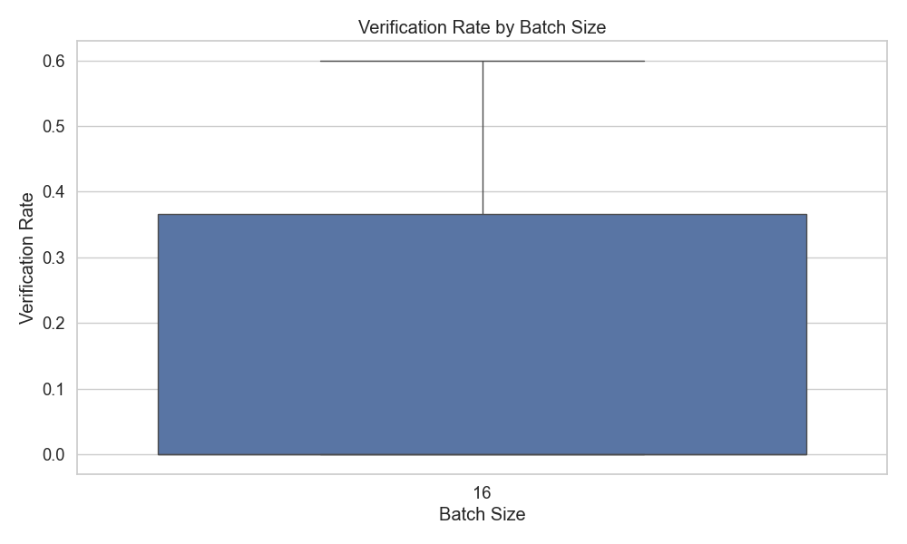

# Assistant Fine-Tuning Performance Analysis

This document summarizes the results of fine-tuning experiments for generating formal postconditions for smart contracts using different GPT models. The analysis is based on 269 total runs.

## Overall Performance Analysis

This section presents the overall success rates of each model across all tasks. Success is defined as generating postconditions that pass verification.

**Total Runs Analyzed:** 269

**Overall Success Rates:**

| model | verification_rate | verified_count | total_runs |
| :--- | :--- | :--- | :--- |
| erc-1155-001-5-16 | 60.00 | 6 | 10 |
| erc-1155-005-5-16 | 50.00 | 5 | 10 |
| erc-1155-005-7-16 | 50.00 | 5 | 10 |
| erc-1155-010-5-16 | 50.00 | 5 | 10 |
| erc-20-001-3-16 | 40.00 | 4 | 10 |
| erc-1155-001-7-16 | 40.00 | 4 | 10 |
| erc-1155-005-3-16 | 40.00 | 4 | 10 |
| erc-721-001-5-16 | 33.33 | 3 | 9 |
| erc-721-001-3-16 | 30.00 | 3 | 10 |
| erc-1155-001-3-16 | 30.00 | 3 | 10 |
| erc-20-001-5-16 | 10.00 | 1 | 10 |
| erc-721-001-7-16 | 10.00 | 1 | 10 |
| erc-20-010-5-16 | 0.00 | 0 | 10 |
| erc-1155-010-3-16 | 0.00 | 0 | 10 |
| erc-1155-010-7-16 | 0.00 | 0 | 10 |
| erc-20-001-7-16 | 0.00 | 0 | 10 |
| erc-20-005-3-16 | 0.00 | 0 | 10 |
| erc-20-005-7-16 | 0.00 | 0 | 10 |
| erc-20-010-3-16 | 0.00 | 0 | 10 |
| erc-721-005-5-16 | 0.00 | 0 | 10 |
| erc-20-010-7-16 | 0.00 | 0 | 10 |
| erc-20-005-5-16 | 0.00 | 0 | 10 |
| erc-721-010-3-16 | 0.00 | 0 | 10 |
| erc-721-005-3-16 | 0.00 | 0 | 10 |
| erc-721-010-5-16 | 0.00 | 0 | 10 |
| erc-721-005-7-16 | 0.00 | 0 | 10 |
| erc-721-010-7-16 | 0.00 | 0 | 10 |

**Key Observations:**

- The 'erc-1155-001-5-16' model achieved the highest overall success rate at 60.00%.
- The average verification rate across all models was 16.42%.
- The 'erc-721-010-7-16' model had the lowest success rate at 0.00%.

## Model Specificity Analysis

This section examines how well each model performs when requested to generate postconditions for a particular contract standard.

**Success Rate (%) for each Model on each Requested Type:**

| model | erc1155 |
| :--- | :--- |
| erc-721-010-7-16 | 0.00 |
| erc-721-010-5-16 | 0.00 |
| erc-721-010-3-16 | 0.00 |
| erc-721-005-7-16 | 0.00 |
| erc-721-005-5-16 | 0.00 |
| erc-721-005-3-16 | 0.00 |
| erc-721-001-7-16 | 10.00 |
| erc-721-001-5-16 | 33.33 |
| erc-721-001-3-16 | 30.00 |
| erc-20-010-7-16 | 0.00 |
| erc-20-010-5-16 | 0.00 |
| erc-20-010-3-16 | 0.00 |
| erc-20-005-7-16 | 0.00 |
| erc-20-005-5-16 | 0.00 |
| erc-20-005-3-16 | 0.00 |
| erc-20-001-7-16 | 0.00 |
| erc-20-001-5-16 | 10.00 |
| erc-20-001-3-16 | 40.00 |
| erc-1155-010-7-16 | 0.00 |
| erc-1155-010-5-16 | 50.00 |
| erc-1155-010-3-16 | 0.00 |
| erc-1155-005-7-16 | 50.00 |
| erc-1155-005-5-16 | 50.00 |
| erc-1155-005-3-16 | 40.00 |
| erc-1155-001-7-16 | 40.00 |
| erc-1155-001-5-16 | 60.00 |
| erc-1155-001-3-16 | 30.00 |

**Successful Runs / Total Runs for each Model on each Requested Type:**

| model | erc1155 |
| :--- | :--- |
| erc-721-010-7-16 | 0 / 10 |
| erc-721-010-5-16 | 0 / 10 |
| erc-721-010-3-16 | 0 / 10 |
| erc-721-005-7-16 | 0 / 10 |
| erc-721-005-5-16 | 0 / 10 |
| erc-721-005-3-16 | 0 / 10 |
| erc-721-001-7-16 | 1 / 10 |
| erc-721-001-5-16 | 3 / 9 |
| erc-721-001-3-16 | 3 / 10 |
| erc-20-010-7-16 | 0 / 10 |
| erc-20-010-5-16 | 0 / 10 |
| erc-20-010-3-16 | 0 / 10 |
| erc-20-005-7-16 | 0 / 10 |
| erc-20-005-5-16 | 0 / 10 |
| erc-20-005-3-16 | 0 / 10 |
| erc-20-001-7-16 | 0 / 10 |
| erc-20-001-5-16 | 1 / 10 |
| erc-20-001-3-16 | 4 / 10 |
| erc-1155-010-7-16 | 0 / 10 |
| erc-1155-010-5-16 | 5 / 10 |
| erc-1155-010-3-16 | 0 / 10 |
| erc-1155-005-7-16 | 5 / 10 |
| erc-1155-005-5-16 | 5 / 10 |
| erc-1155-005-3-16 | 4 / 10 |
| erc-1155-001-7-16 | 4 / 10 |
| erc-1155-001-5-16 | 6 / 10 |
| erc-1155-001-3-16 | 3 / 10 |

## Efficiency Analysis

This section evaluates the efficiency of the models in terms of the number of iterations and time taken to reach a successful verification or exhaust attempts.

**Average Iterations and Time per Model:**

| model | avg_fail_iterations | avg_success_iterations | avg_fail_time | avg_success_time | fail_rate |
| :--- | :--- | :--- | :--- | :--- | :--- |
| erc-20-005-5-16 | 10.0 | 0.0 | 344.77390298843386 | 0.0 | 100.00 |
| erc-20-005-3-16 | 10.0 | 0.0 | 375.76180896759035 | 0.0 | 100.00 |
| erc-721-010-5-16 | 10.0 | 0.0 | 187.561115026474 | 0.0 | 100.00 |
| erc-721-010-3-16 | 10.0 | 0.0 | 176.60926826000212 | 0.0 | 100.00 |
| erc-721-005-7-16 | 10.0 | 0.0 | 181.36573247909547 | 0.0 | 100.00 |
| erc-721-005-5-16 | 10.0 | 0.0 | 188.43282148838043 | 0.0 | 100.00 |
| erc-721-005-3-16 | 10.0 | 0.0 | 247.2128398180008 | 0.0 | 100.00 |
| erc-20-010-7-16 | 10.0 | 0.0 | 272.3052050828934 | 0.0 | 100.00 |
| erc-20-010-5-16 | 10.0 | 0.0 | 388.9166532278061 | 0.0 | 100.00 |
| erc-20-010-3-16 | 10.0 | 0.0 | 359.22117338180544 | 0.0 | 100.00 |
| erc-20-005-7-16 | 10.0 | 0.0 | 324.81093435287477 | 0.0 | 100.00 |
| erc-721-010-7-16 | 10.0 | 0.0 | 181.49588105678558 | 0.0 | 100.00 |
| erc-20-001-7-16 | 10.0 | 0.0 | 251.55123615264893 | 0.0 | 100.00 |
| erc-1155-010-7-16 | 10.0 | 0.0 | 268.5577013015747 | 0.0 | 100.00 |
| erc-1155-010-3-16 | 10.0 | 0.0 | 252.67014882564544 | 0.0 | 100.00 |
| erc-20-001-5-16 | 10.0 | 9.0 | 319.5671892695957 | 456.85076785087585 | 90.00 |
| erc-721-001-7-16 | 10.0 | 3.0 | 365.03221453560724 | 109.90961384773254 | 90.00 |
| erc-721-001-3-16 | 10.0 | 2.3333333333333335 | 456.81361205237255 | 146.17995484670004 | 70.00 |
| erc-1155-001-3-16 | 10.0 | 3.0 | 443.08687826565335 | 225.49767963091531 | 70.00 |
| erc-721-001-5-16 | 10.0 | 1.0 | 308.9347548087438 | 84.61758232116699 | 66.67 |
| erc-20-001-3-16 | 10.0 | 4.5 | 495.92361211776733 | 277.51286828517914 | 60.00 |
| erc-1155-005-3-16 | 10.0 | 4.0 | 329.65803599357605 | 183.01379412412643 | 60.00 |
| erc-1155-001-7-16 | 10.0 | 2.75 | 367.5579106807709 | 170.93733376264572 | 60.00 |
| erc-1155-010-5-16 | 10.0 | 2.0 | 246.2312921524048 | 98.19168214797973 | 50.00 |
| erc-1155-005-7-16 | 10.0 | 3.4 | 296.12227630615234 | 199.30102972984315 | 50.00 |
| erc-1155-005-5-16 | 10.0 | 2.0 | 315.2278193950653 | 131.21311526298524 | 50.00 |
| erc-1155-001-5-16 | 10.0 | 1.0 | 302.91807371377945 | 73.74164454142253 | 40.00 |

## Hyperparameter Analysis

This section analyzes the impact of different hyperparameters (learning rate, epochs, batch size) on model performance.

### By Learning Rate

### By Epochs

### By Batch Size

## Function-level Verification Analysis

This section examines which specific functions are most successfully verified by each model.

## Overall Conclusion

Based on the analysis, the following conclusions can be drawn:

1. The models `erc-1155-001-5-16`, `erc-1155-005-5-16` and `erc-1155-005-7-16` demonstrated the highest overall verification rates.
