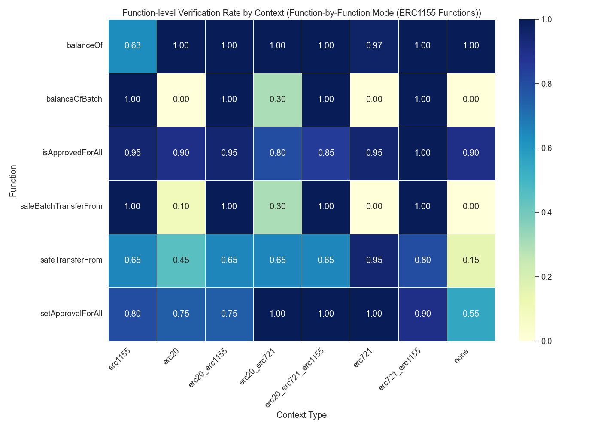

# Context Enhancement Performance Analysis for ERC1155 (Function-by-Function Mode)

This document analyzes context enhancement strategies for formal postcondition generation in smart contracts. Analysis based on 80 total runs.

## Overall Performance Analysis

Success rates for generating postconditions that pass formal verification.

**Total Runs Analyzed:** 80

| context_type         | verification_rate | verified_count | total_runs | avg_time           | avg_iterations |
| :------------------- | :---------------- | :------------- | :--------- | :----------------- | :------------- |
| erc721_erc1155       | 100.00            | 10             | 10         | 174.54264001846315 | 8.6            |
| erc20_erc721_erc1155 | 100.00            | 10             | 10         | 178.51760411262512 | 8.7            |
| erc1155              | 90.00             | 9              | 10         | 164.22338471412658 | 8.1            |
| erc20_erc1155        | 80.00             | 8              | 10         | 213.80932102203369 | 10.6           |
| erc20_erc721         | 30.00             | 3              | 10         | 578.6858938217163  | 27.1           |
| erc20                | 0.00              | 0              | 10         | 711.0509649515152  | 31.4           |
| erc721               | 0.00              | 0              | 10         | 646.977520775795   | 29.6           |
| none                 | 0.00              | 0              | 10         | 788.6456270694732  | 33.1           |

**Key Observations:**

- Best performing context: 'erc721_erc1155' with 100.00% success rate
- Average success rate: 50.00%
- Lowest performing context: 'none' with 0.00% success rate

## Efficiency Analysis

Analysis of iterations and time required for successful vs failed verification attempts.

| context_type         | avg_fail_iterations | avg_success_iterations | avg_fail_time     | avg_success_time   | fail_rate |
| :------------------- | :------------------ | :--------------------- | :---------------- | :----------------- | :-------- |
| erc20                | 31.4                | 0.0                    | 711.0509649515152 | 0.0                | 100.00    |
| erc721               | 29.6                | 0.0                    | 646.977520775795  | 0.0                | 100.00    |
| none                 | 33.1                | 0.0                    | 788.6456270694732 | 0.0                | 100.00    |
| erc20_erc721         | 36.142857142857146  | 6.0                    | 776.3519785744803 | 117.46502939860027 | 70.00     |
| erc20_erc1155        | 17.5                | 8.875                  | 371.6934245824814 | 174.33829513192177 | 20.00     |
| erc1155              | 16.0                | 7.222222222222222      | 268.9300618171692 | 152.5893094804552  | 10.00     |
| erc20_erc721_erc1155 | 0.0                 | 8.7                    | 0.0               | 178.51760411262512 | 0.00      |
| erc721_erc1155       | 0.0                 | 8.6                    | 0.0               | 174.54264001846315 | 0.00      |

## Function-level Verification Analysis

Analysis of which specific smart contract functions are most successfully verified.

## Conclusions and Recommendations

**Key Findings:**

1. Top performing contexts: `erc721_erc1155`, `erc20_erc721_erc1155`, `erc1155`
2. Base model without context: 0.00%

_Report generated on 2025-09-11 14:42:15_
