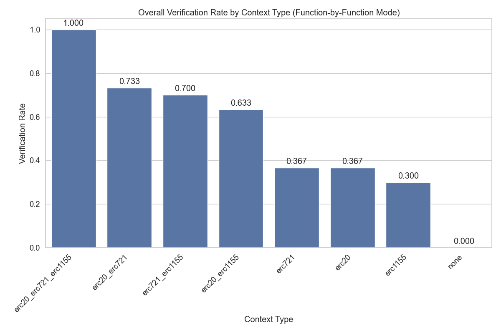

# Context Enhancement Performance Analysis for ERC20 (Function-by-Function Mode)

This document analyzes context enhancement strategies for formal postcondition generation in smart contracts. Analysis based on 80 total runs.

## Overall Performance Analysis

Success rates for generating postconditions that pass formal verification.

**Total Runs Analyzed:** 80

| context_type         | verification_rate | verified_count | total_runs | avg_time           | avg_iterations |
| :------------------- | :---------------- | :------------- | :--------- | :----------------- | :------------- |
| erc20                | 100.00            | 10             | 10         | 699.8511210203171  | 15.0           |
| erc20_erc1155        | 100.00            | 10             | 10         | 433.0861841917038  | 13.4           |
| erc20_erc721         | 100.00            | 10             | 10         | 640.2869050979614  | 14.2           |
| erc20_erc721_erc1155 | 100.00            | 10             | 10         | 277.0920076131821  | 13.4           |
| erc721_erc1155       | 10.00             | 1              | 10         | 466.64506659507754 | 24.8           |
| erc721               | 10.00             | 1              | 10         | 1000.0655307531357 | 25.6           |
| erc1155              | 0.00              | 0              | 10         | 1082.5364722251893 | 32.0           |
| none                 | 0.00              | 0              | 10         | 983.2470988512039  | 32.8           |

**Key Observations:**

- Best performing context: 'erc20' with 100.00% success rate
- Average success rate: 52.50%
- Lowest performing context: 'none' with 0.00% success rate

## Efficiency Analysis

Analysis of iterations and time required for successful vs failed verification attempts.

| context_type         | avg_fail_iterations | avg_success_iterations | avg_fail_time      | avg_success_time  | fail_rate |
| :------------------- | :------------------ | :--------------------- | :----------------- | :---------------- | :-------- |
| erc1155              | 32.0                | 0.0                    | 1082.5364722251893 | 0.0               | 100.00    |
| none                 | 32.8                | 0.0                    | 983.2470988512039  | 0.0               | 100.00    |
| erc721               | 27.11111111111111   | 12.0                   | 1057.9426667425369 | 479.171306848526  | 90.00     |
| erc721_erc1155       | 25.555555555555557  | 18.0                   | 478.83533239364624 | 356.932674407959  | 90.00     |
| erc20_erc721         | 0.0                 | 14.2                   | 0.0                | 640.2869050979614 | 0.00      |
| erc20_erc1155        | 0.0                 | 13.4                   | 0.0                | 433.0861841917038 | 0.00      |
| erc20                | 0.0                 | 15.0                   | 0.0                | 699.8511210203171 | 0.00      |
| erc20_erc721_erc1155 | 0.0                 | 13.4                   | 0.0                | 277.0920076131821 | 0.00      |

## Function-level Verification Analysis

Analysis of which specific smart contract functions are most successfully verified.

## Conclusions and Recommendations

**Key Findings:**

1. Top performing contexts: `erc20`, `erc20_erc1155`, `erc20_erc721`
2. Base model without context: 0.00%

_Report generated on 2025-09-11 14:45:51_
