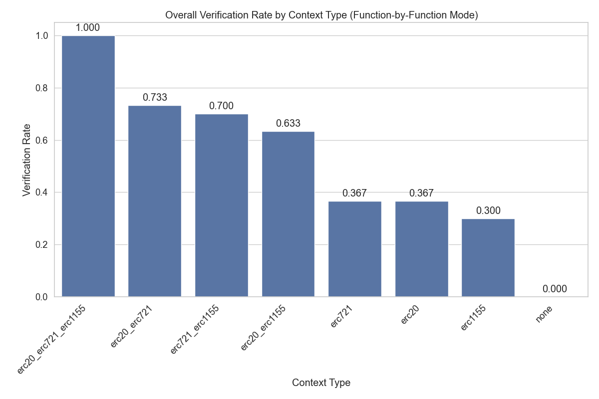
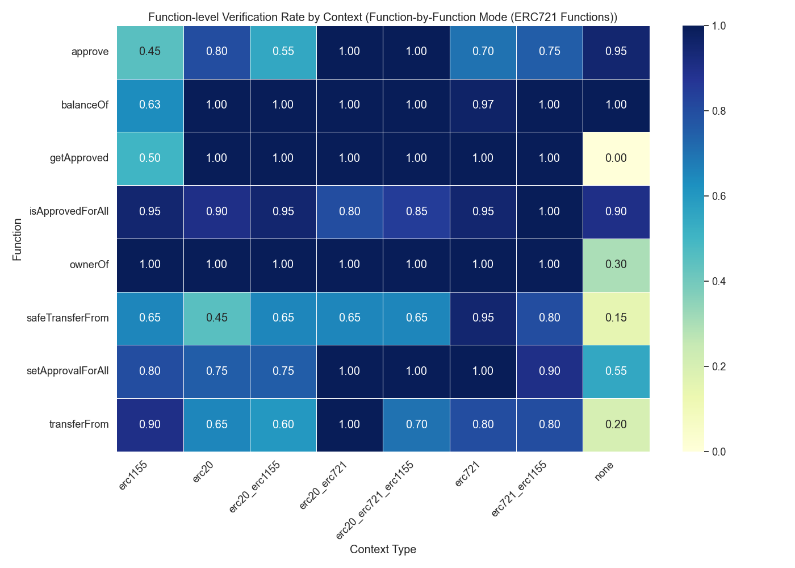

# Context Enhancement Performance Analysis for ERC721 (Function-by-Function Mode)

This document analyzes context enhancement strategies for formal postcondition generation in smart contracts. Analysis based on 80 total runs.

## Overall Performance Analysis

Success rates for generating postconditions that pass formal verification.

**Total Runs Analyzed:** 80

| context_type         | verification_rate | verified_count | total_runs | avg_time           | avg_iterations |
| :------------------- | :---------------- | :------------- | :--------- | :----------------- | :------------- |
| erc721               | 100.00            | 10             | 10         | 388.6587363243103  | 19.2           |
| erc721_erc1155       | 100.00            | 10             | 10         | 477.9486929416656  | 24.0           |
| erc20_erc721_erc1155 | 100.00            | 10             | 10         | 547.515124464035   | 31.3           |
| erc20_erc721         | 90.00             | 9              | 10         | 477.62825832366946 | 22.8           |
| erc20                | 10.00             | 1              | 10         | 705.2005512714386  | 45.0           |
| erc20_erc1155        | 10.00             | 1              | 10         | 786.7115369558335  | 43.9           |
| erc1155              | 0.00              | 0              | 10         | 805.2870501995087  | 44.6           |
| none                 | 0.00              | 0              | 10         | 800.0170464277268  | 62.8           |

**Key Observations:**

- Best performing context: 'erc721' with 100.00% success rate
- Average success rate: 51.25%
- Lowest performing context: 'none' with 0.00% success rate

## Efficiency Analysis

Analysis of iterations and time required for successful vs failed verification attempts.

| context_type         | avg_fail_iterations | avg_success_iterations | avg_fail_time     | avg_success_time   | fail_rate |
| :------------------- | :------------------ | :--------------------- | :---------------- | :----------------- | :-------- |
| erc1155              | 44.6                | 0.0                    | 805.2870501995087 | 0.0                | 100.00    |
| none                 | 62.8                | 0.0                    | 800.0170464277268 | 0.0                | 100.00    |
| erc20_erc1155        | 45.77777777777778   | 27.0                   | 821.9023745324877 | 469.99399876594543 | 90.00     |
| erc20                | 46.111111111111114  | 35.0                   | 719.4188378916847 | 577.2359716892242  | 90.00     |
| erc20_erc721         | 27.0                | 22.333333333333332     | 495.7119207382202 | 475.61896249983045 | 10.00     |
| erc20_erc721_erc1155 | 0.0                 | 31.3                   | 0.0               | 547.515124464035   | 0.00      |
| erc721               | 0.0                 | 19.2                   | 0.0               | 388.6587363243103  | 0.00      |
| erc721_erc1155       | 0.0                 | 24.0                   | 0.0               | 477.9486929416656  | 0.00      |

## Function-level Verification Analysis

Analysis of which specific smart contract functions are most successfully verified.

## Conclusions and Recommendations

**Key Findings:**

1. Top performing contexts: `erc721`, `erc721_erc1155`, `erc20_erc721_erc1155`
2. Base model without context: 0.00%

_Report generated on 2025-09-11 14:45:56_
