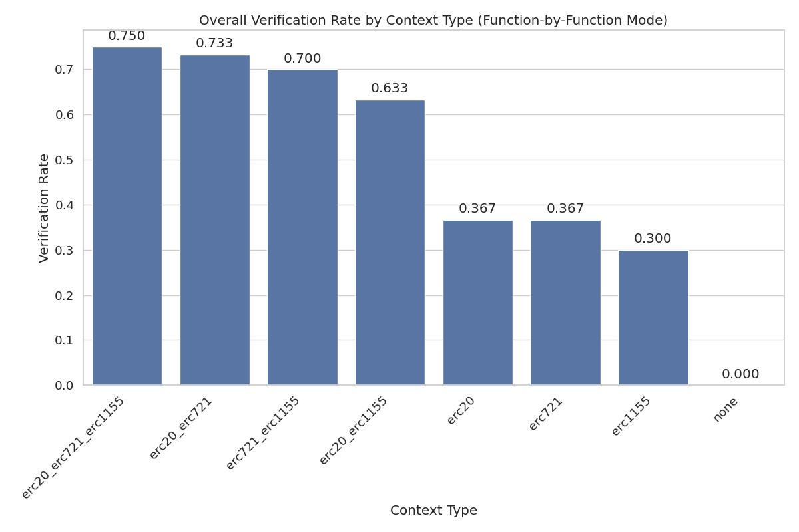
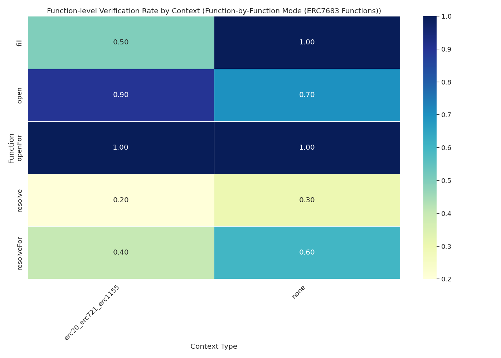

# Context Enhancement Performance Analysis for ERC7683 (Function-by-Function Mode)

This document analyzes context enhancement strategies for formal postcondition generation in smart contracts. Analysis based on 20 total runs.

## Overall Performance Analysis

Success rates for generating postconditions that pass formal verification.

**Total Runs Analyzed:** 20

| context_type | verification_rate | verified_count | total_runs | avg_time | avg_iterations |
| :--- | :--- | :--- | :--- | :--- | :--- |
| erc20_erc721_erc1155 | 0.00 | 0 | 10 | 654.8211612462998 | 28.5 |
| none | 0.00 | 0 | 10 | 427.1596494436264 | 20.9 |

**Key Observations:**

- Best performing context: 'erc20_erc721_erc1155' with 0.00% success rate
- Average success rate: 0.00%
- Lowest performing context: 'none' with 0.00% success rate

## Efficiency Analysis

Analysis of iterations and time required for successful vs failed verification attempts.

| context_type | avg_fail_iterations | avg_success_iterations | avg_fail_time | avg_success_time | fail_rate |
| :--- | :--- | :--- | :--- | :--- | :--- |
| erc20_erc721_erc1155 | 28.5 | 0.0 | 654.8211612462998 | 0.0 | 100.00 |
| none | 20.9 | 0.0 | 427.1596494436264 | 0.0 | 100.00 |

## Function-level Verification Analysis

Analysis of which specific smart contract functions are most successfully verified.

## Conclusions and Recommendations

**Key Findings:**

1. Top performing contexts: `erc20_erc721_erc1155`, `none`
2. Base model without context: 0.00%

*Report generated on 2025-10-30 14:59:18*
