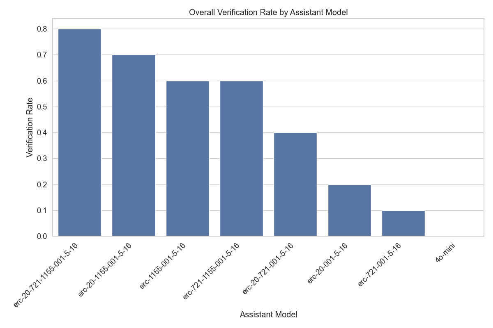
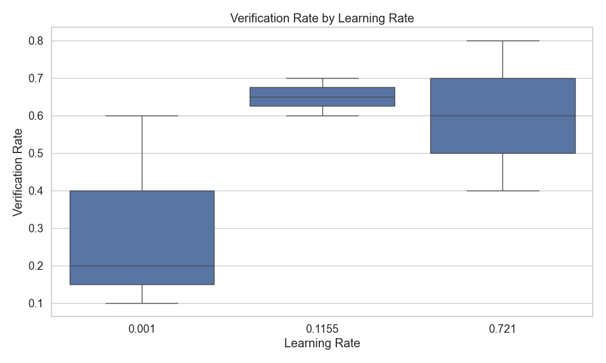
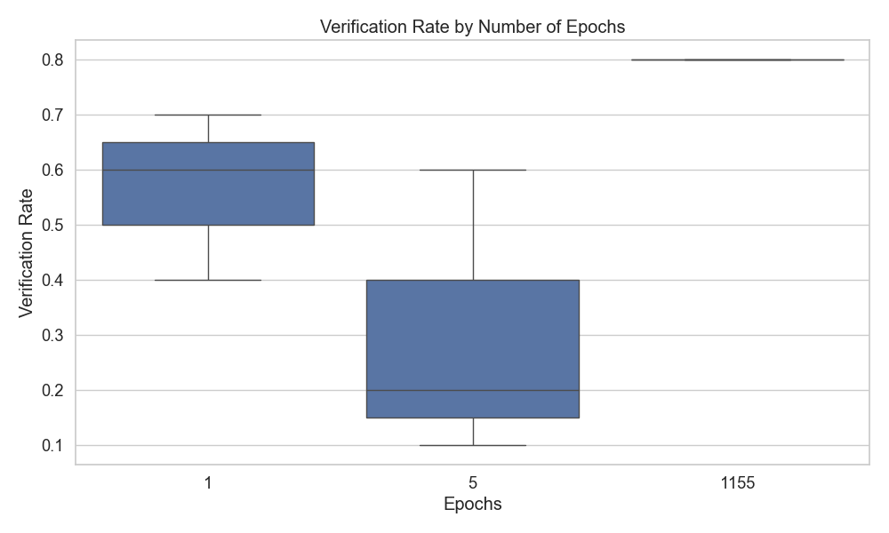
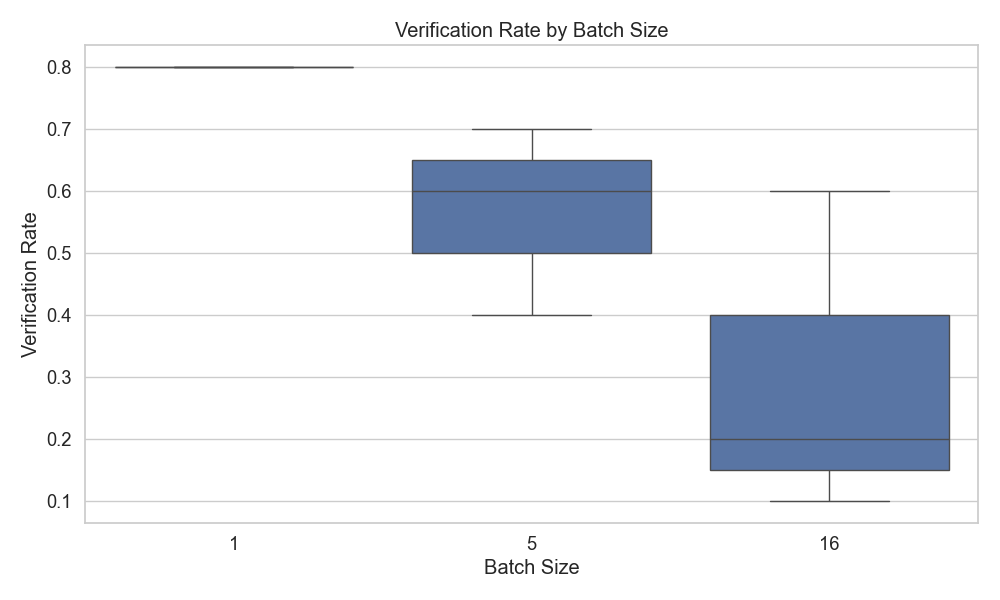
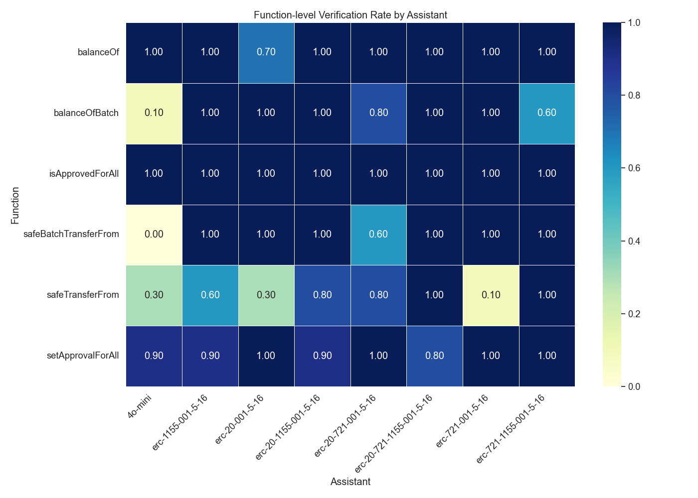

# Assistant Fine-Tuning Performance Analysis Function by Function

This document summarizes the results of fine-tuning experiments for generating formal postconditions for smart contracts using different GPT models. The analysis is based on 80 total runs.

## Overall Performance Analysis

This section presents the overall success rates of each model across all tasks. Success is defined as generating postconditions that pass verification.

**Total Runs Analyzed:** 80

**Overall Success Rates:**

| model | verification_rate | verified_count | total_runs |
| :--- | :--- | :--- | :--- |
| erc-20-721-1155-001-5-16 | 80.00 | 8 | 10 |
| erc-20-1155-001-5-16 | 70.00 | 7 | 10 |
| erc-1155-001-5-16 | 60.00 | 6 | 10 |
| erc-721-1155-001-5-16 | 60.00 | 6 | 10 |
| erc-20-721-001-5-16 | 40.00 | 4 | 10 |
| erc-20-001-5-16 | 20.00 | 2 | 10 |
| erc-721-001-5-16 | 10.00 | 1 | 10 |
| 4o-mini | 0.00 | 0 | 10 |

**Key Observations:**

- The 'erc-20-721-1155-001-5-16' model achieved the highest overall success rate at 80.00%.
- The average verification rate across all models was 42.50%.
- The '4o-mini' model had the lowest success rate at 0.00%.

## Model Specificity Analysis

This section examines how well each model performs when requested to generate postconditions for a particular contract standard.

**Success Rate (%) for each Model on each Requested Type:**

| model | erc1155 |
| :--- | :--- |
| erc-721-1155-001-5-16 | 60.00 |
| erc-721-001-5-16 | 10.00 |
| erc-20-721-1155-001-5-16 | 80.00 |
| erc-20-721-001-5-16 | 40.00 |
| erc-20-1155-001-5-16 | 70.00 |
| erc-20-001-5-16 | 20.00 |
| erc-1155-001-5-16 | 60.00 |
| 4o-mini | 0.00 |

**Successful Runs / Total Runs for each Model on each Requested Type:**

| model | erc1155 |
| :--- | :--- |
| erc-721-1155-001-5-16 | 6 / 10 |
| erc-721-001-5-16 | 1 / 10 |
| erc-20-721-1155-001-5-16 | 8 / 10 |
| erc-20-721-001-5-16 | 4 / 10 |
| erc-20-1155-001-5-16 | 7 / 10 |
| erc-20-001-5-16 | 2 / 10 |
| erc-1155-001-5-16 | 6 / 10 |
| 4o-mini | 0 / 10 |

## Efficiency Analysis

This section evaluates the efficiency of the models in terms of the number of iterations and time taken to reach a successful verification or exhaust attempts.

**Average Iterations and Time per Model:**

| model | avg_fail_iterations | avg_success_iterations | avg_fail_time | avg_success_time | fail_rate |
| :--- | :--- | :--- | :--- | :--- | :--- |
| 4o-mini | 32.1 | 0.0 | 765.9586936473846 | 0.0 | 100.00 |
| erc-721-001-5-16 | 15.666666666666666 | 8.0 | 286.31553959846497 | 158.2315013408661 | 90.00 |
| erc-20-001-5-16 | 18.375 | 6.0 | 313.27046370506287 | 102.50507664680481 | 80.00 |
| erc-20-721-001-5-16 | 20.833333333333332 | 9.5 | 317.0958256324132 | 167.6201977133751 | 60.00 |
| erc-1155-001-5-16 | 17.25 | 7.166666666666667 | 440.722040951252 | 179.71604613463083 | 40.00 |
| erc-721-1155-001-5-16 | 18.5 | 8.5 | 250.69626355171204 | 163.79607196648917 | 40.00 |
| erc-20-1155-001-5-16 | 17.666666666666668 | 9.857142857142858 | 549.7526532014211 | 331.2002204486302 | 30.00 |
| erc-20-721-1155-001-5-16 | 16.0 | 9.875 | 426.118123292923 | 258.2129156887531 | 20.00 |

## Hyperparameter Analysis

This section analyzes the impact of different hyperparameters (learning rate, epochs, batch size) on model performance.

### By Learning Rate

### By Epochs

### By Batch Size

## Function-level Verification Analysis

This section examines which specific functions are most successfully verified by each model.

## Overall Conclusion

Based on the analysis, the following conclusions can be drawn:

1. The models `erc-20-721-1155-001-5-16`, `erc-20-1155-001-5-16` and `erc-1155-001-5-16` demonstrated the highest overall verification rates.
2. Fine-tuning generally improved performance compared to the baseline `4o-mini` model (verification rate: 0.00%).
3. The optimal hyperparameters appear to be a learning rate of 0.116, 1155 epochs, and a batch size of 1.
4. Successful verification attempts are significantly faster than failed attempts, suggesting that early success indicators can help determine when a model is likely to produce valid postconditions.

*Report generated on 2025-05-30 14:23:03*
