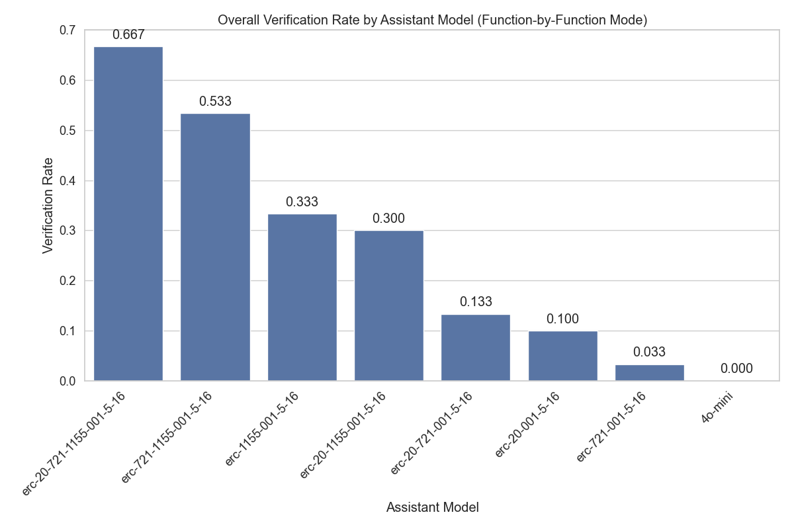

# Assistant Fine-Tuning Performance Analysis for ERC1155 (Function-by-Function Mode)

This document analyzes fine-tuning experiments for formal postcondition generation in smart contracts. Analysis based on 80 total runs.

## Overall Performance Analysis

Success rates for generating postconditions that pass formal verification.

**Total Runs Analyzed:** 80

| model                    | verification_rate | verified_count | total_runs |
| :----------------------- | :---------------- | :------------- | :--------- |
| erc-20-1155-001-5-16     | 80.00             | 8              | 10         |
| erc-1155-001-5-16        | 70.00             | 7              | 10         |
| erc-20-721-001-5-16      | 70.00             | 7              | 10         |
| erc-721-1155-001-5-16    | 70.00             | 7              | 10         |
| erc-20-721-1155-001-5-16 | 60.00             | 6              | 10         |
| erc-20-001-5-16          | 20.00             | 2              | 10         |
| 4o-mini                  | 10.00             | 1              | 10         |
| erc-721-001-5-16         | 10.00             | 1              | 10         |

**Key Observations:**

- Best performing model: 'erc-20-1155-001-5-16' with 80.00% success rate
- Average success rate: 48.75%
- Lowest performing model: 'erc-721-001-5-16' with 10.00% success rate

## Efficiency Analysis

Analysis of iterations and time required for successful vs failed verification attempts.

| model                    | avg_fail_iterations | avg_success_iterations | avg_fail_time      | avg_success_time   | fail_rate |
| :----------------------- | :------------------ | :--------------------- | :----------------- | :----------------- | :-------- |
| 4o-mini                  | 23.0                | 7.0                    | 474.8125154177348  | 162.88458824157715 | 90.00     |
| erc-721-001-5-16         | 19.11111111111111   | 14.0                   | 1282.1339366171096 | 406.98040080070496 | 90.00     |
| erc-20-001-5-16          | 23.5                | 8.0                    | 566.390415251255   | 243.55229711532593 | 80.00     |
| erc-20-721-1155-001-5-16 | 19.5                | 11.833333333333334     | 1453.2148068547249 | 855.4368302027384  | 40.00     |
| erc-1155-001-5-16        | 15.0                | 9.142857142857142      | 1068.1294465065002 | 607.4764891011374  | 30.00     |
| erc-20-721-001-5-16      | 21.0                | 11.714285714285714     | 1175.8349273204803 | 1125.6876270771027 | 30.00     |
| erc-721-1155-001-5-16    | 15.0                | 7.857142857142857      | 1029.3852731386821 | 631.110694544656   | 30.00     |
| erc-20-1155-001-5-16     | 16.0                | 7.875                  | 974.8040870428085  | 574.9083345532417  | 20.00     |

## Function-level Verification Analysis

Analysis of which specific smart contract functions are most successfully verified.

## Conclusions and Recommendations

**Key Findings:**

1. Top performing models: `erc-20-1155-001-5-16`, `erc-1155-001-5-16`, `erc-20-721-001-5-16`
2. Baseline model (4o-mini) performance: 10.00%
3. Successful verifications are faster than failed attempts, indicating early success predictors

_Report generated on 2025-08-29 22:18:29_
