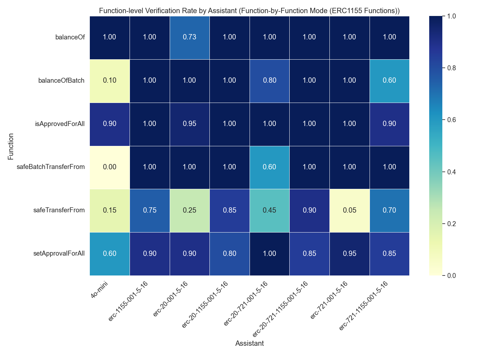

# Assistant Fine-Tuning Performance Analysis for ERC1155 (Function-by-Function Mode)

This document analyzes fine-tuning experiments for formal postcondition generation in smart contracts. Analysis based on 80 total runs.

## Overall Performance Analysis

Success rates for generating postconditions that pass formal verification.

**Total Runs Analyzed:** 80

| model | verification_rate | verified_count | total_runs |
| :--- | :--- | :--- | :--- |
| erc-20-721-1155-001-5-16 | 80.00 | 8 | 10 |
| erc-20-1155-001-5-16 | 70.00 | 7 | 10 |
| erc-721-1155-001-5-16 | 60.00 | 6 | 10 |
| erc-1155-001-5-16 | 60.00 | 6 | 10 |
| erc-20-721-001-5-16 | 40.00 | 4 | 10 |
| erc-20-001-5-16 | 20.00 | 2 | 10 |
| erc-721-001-5-16 | 10.00 | 1 | 10 |
| 4o-mini | 0.00 | 0 | 10 |

**Key Observations:**

- Best performing model: 'erc-20-721-1155-001-5-16' with 80.00% success rate
- Average success rate: 42.50%
- Lowest performing model: '4o-mini' with 0.00% success rate

## Efficiency Analysis

Analysis of iterations and time required for successful vs failed verification attempts.

| model | avg_fail_iterations | avg_success_iterations | avg_fail_time | avg_success_time | fail_rate |
| :--- | :--- | :--- | :--- | :--- | :--- |
| 4o-mini | 32.1 | 0.0 | 765.9586936473846 | 0.0 | 100.00 |
| erc-721-001-5-16 | 15.666666666666666 | 8.0 | 286.31553959846497 | 158.2315013408661 | 90.00 |
| erc-20-001-5-16 | 18.375 | 6.0 | 313.27046370506287 | 102.50507664680481 | 80.00 |
| erc-20-721-001-5-16 | 20.833333333333332 | 9.5 | 317.0958256324132 | 167.6201977133751 | 60.00 |
| erc-721-1155-001-5-16 | 18.5 | 8.5 | 250.69626355171204 | 163.79607196648917 | 40.00 |
| erc-1155-001-5-16 | 17.25 | 7.166666666666667 | 440.722040951252 | 179.71604613463083 | 40.00 |
| erc-20-1155-001-5-16 | 17.666666666666668 | 9.857142857142858 | 549.7526532014211 | 331.2002204486302 | 30.00 |
| erc-20-721-1155-001-5-16 | 16.0 | 9.875 | 426.118123292923 | 258.2129156887531 | 20.00 |

## Function-level Verification Analysis

Analysis of which specific smart contract functions are most successfully verified.

## Conclusions and Recommendations

**Key Findings:**

1. Top performing models: `erc-20-721-1155-001-5-16`, `erc-20-1155-001-5-16`, `erc-721-1155-001-5-16`
2. Baseline model (4o-mini) performance: 0.00%
3. Successful verifications are faster than failed attempts, indicating early success predictors

*Report generated on 2025-09-11 14:53:21*
