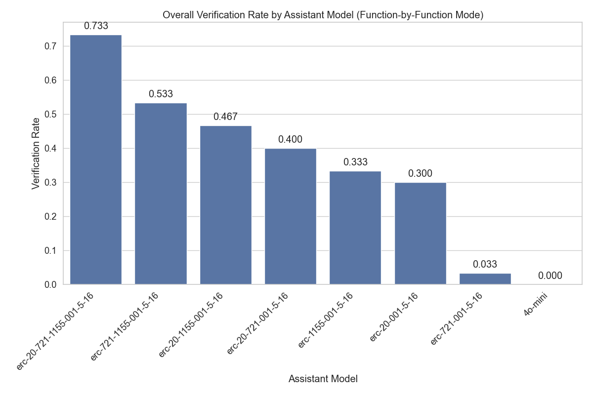
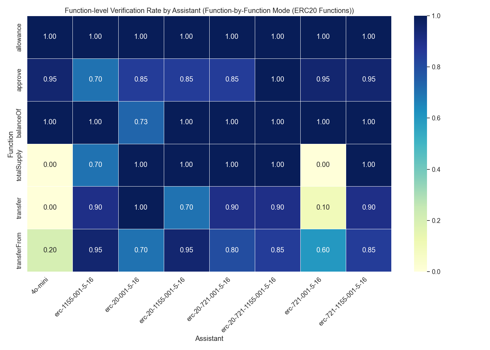

# Assistant Fine-Tuning Performance Analysis for ERC20 (Function-by-Function Mode)

This document analyzes fine-tuning experiments for formal postcondition generation in smart contracts. Analysis based on 70 total runs.

## Overall Performance Analysis

Success rates for generating postconditions that pass formal verification.

**Total Runs Analyzed:** 70

| model                    | verification_rate | verified_count | total_runs |
| :----------------------- | :---------------- | :------------- | :--------- |
| erc-721-1155-001-5-16    | 80.00             | 8              | 10         |
| erc-20-721-1155-001-5-16 | 70.00             | 7              | 10         |
| erc-1155-001-5-16        | 20.00             | 2              | 10         |
| erc-20-1155-001-5-16     | 20.00             | 2              | 10         |
| erc-20-001-5-16          | 0.00              | 0              | 10         |
| erc-20-721-001-5-16      | 0.00              | 0              | 10         |
| erc-721-001-5-16         | 0.00              | 0              | 10         |

**Key Observations:**

- Best performing model: 'erc-721-1155-001-5-16' with 80.00% success rate
- Average success rate: 27.14%
- Lowest performing model: 'erc-721-001-5-16' with 0.00% success rate

## Efficiency Analysis

Analysis of iterations and time required for successful vs failed verification attempts.

| model                    | avg_fail_iterations | avg_success_iterations | avg_fail_time      | avg_success_time   | fail_rate |
| :----------------------- | :------------------ | :--------------------- | :----------------- | :----------------- | :-------- |
| erc-20-001-5-16          | 31.4                | 0.0                    | 328.10283868312837 | 0.0                | 100.00    |
| erc-20-721-001-5-16      | 26.4                | 0.0                    | 320.0236372232437  | 0.0                | 100.00    |
| erc-721-001-5-16         | 27.4                | 0.0                    | 286.13276574611666 | 0.0                | 100.00    |
| erc-1155-001-5-16        | 21.625              | 9.0                    | 244.70638886094093 | 110.95581293106079 | 80.00     |
| erc-20-1155-001-5-16     | 17.5                | 12.0                   | 210.7502169907093  | 143.3405156135559  | 80.00     |
| erc-20-721-1155-001-5-16 | 19.666666666666668  | 9.571428571428571      | 223.36651571591696 | 110.3314436163221  | 30.00     |
| erc-721-1155-001-5-16    | 18.0                | 11.25                  | 206.10038304328918 | 128.55050814151764 | 20.00     |

## Function-level Verification Analysis

Analysis of which specific smart contract functions are most successfully verified.

## Conclusions and Recommendations

**Key Findings:**

1. Top performing models: `erc-721-1155-001-5-16`, `erc-20-721-1155-001-5-16`, `erc-1155-001-5-16`
2. Successful verifications are faster than failed attempts, indicating early success predictors

_Report generated on 2025-08-31 11:34:20_
