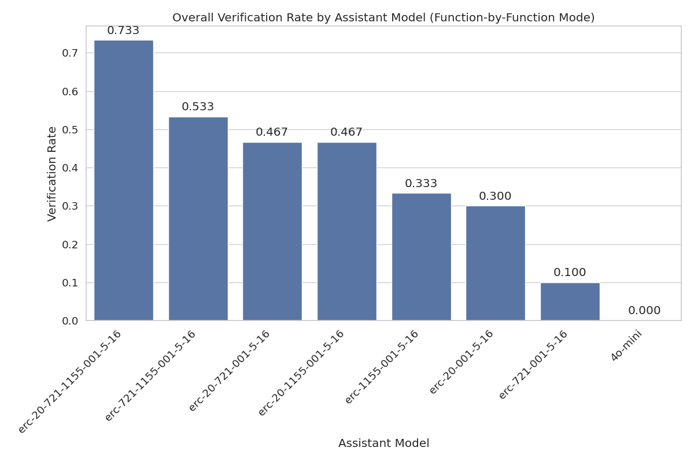
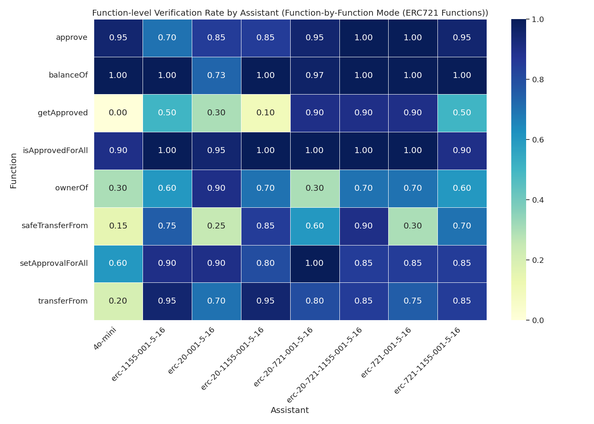

# Assistant Fine-Tuning Performance Analysis for ERC721 (Function-by-Function Mode)

This document analyzes fine-tuning experiments for formal postcondition generation in smart contracts. Analysis based on 70 total runs.

## Overall Performance Analysis

Success rates for generating postconditions that pass formal verification.

**Total Runs Analyzed:** 70

| model                    | verification_rate | verified_count | total_runs |
| :----------------------- | :---------------- | :------------- | :--------- |
| erc-20-721-1155-001-5-16 | 50.00             | 5              | 10         |
| erc-1155-001-5-16        | 20.00             | 2              | 10         |
| erc-721-1155-001-5-16    | 20.00             | 2              | 10         |
| erc-20-001-5-16          | 10.00             | 1              | 10         |
| erc-20-1155-001-5-16     | 0.00              | 0              | 10         |
| erc-20-721-001-5-16      | 0.00              | 0              | 10         |
| erc-721-001-5-16         | 0.00              | 0              | 10         |

**Key Observations:**

- Best performing model: 'erc-20-721-1155-001-5-16' with 50.00% success rate
- Average success rate: 14.29%
- Lowest performing model: 'erc-721-001-5-16' with 0.00% success rate

## Efficiency Analysis

Analysis of iterations and time required for successful vs failed verification attempts.

| model                    | avg_fail_iterations | avg_success_iterations | avg_fail_time      | avg_success_time   | fail_rate |
| :----------------------- | :------------------ | :--------------------- | :----------------- | :----------------- | :-------- |
| erc-20-1155-001-5-16     | 40.0                | 0.0                    | 421.18784120082853 | 0.0                | 100.00    |
| erc-20-721-001-5-16      | 47.2                | 0.0                    | 548.7256472110748  | 0.0                | 100.00    |
| erc-721-001-5-16         | 40.8                | 0.0                    | 566.4404935598374  | 0.0                | 100.00    |
| erc-20-001-5-16          | 53.111111111111114  | 25.0                   | 588.5429035292732  | 345.85872530937195 | 90.00     |
| erc-1155-001-5-16        | 32.625              | 21.0                   | 386.09746038913727 | 345.85367941856384 | 80.00     |
| erc-721-1155-001-5-16    | 49.25               | 31.0                   | 561.0044822394848  | 372.2465310096741  | 80.00     |
| erc-20-721-1155-001-5-16 | 38.0                | 19.4                   | 449.31021637916564 | 235.93012471199035 | 50.00     |

## Function-level Verification Analysis

Analysis of which specific smart contract functions are most successfully verified.

## Conclusions and Recommendations

**Key Findings:**

1. Top performing models: `erc-20-721-1155-001-5-16`, `erc-1155-001-5-16`, `erc-721-1155-001-5-16`
2. Successful verifications are faster than failed attempts, indicating early success predictors

_Report generated on 2025-08-31 11:34:25_
