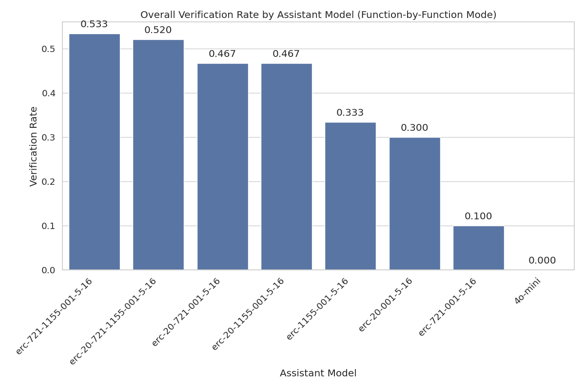
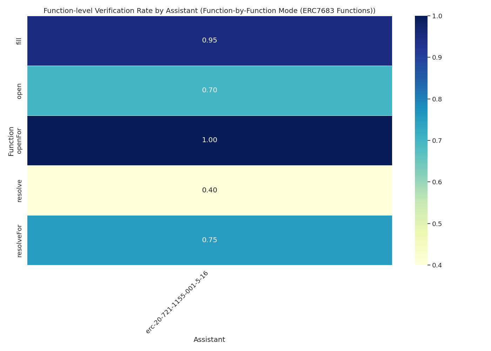

# Assistant Fine-Tuning Performance Analysis for ERC7683 (Function-by-Function Mode)

This document analyzes fine-tuning experiments for formal postcondition generation in smart contracts. Analysis based on 20 total runs.

## Overall Performance Analysis

Success rates for generating postconditions that pass formal verification.

**Total Runs Analyzed:** 20

| model | context_type | verification_rate | verified_count | total_runs | avg_time | avg_iterations |
| :--- | :--- | :--- | :--- | :--- | :--- | :--- |
| erc-20-721-1155-001-5-16 | erc20_erc721_erc1155 | 40.00 | 4 | 10 | 478.84637093544006 | 21.2 |
| erc-20-721-1155-001-5-16 | none | 0.00 | 0 | 10 | 427.1596494436264 | 20.9 |

**Key Observations:**

- Best performing configuration: Model 'erc-20-721-1155-001-5-16' with context 'erc20_erc721_erc1155' (40.00% success rate)
- Average success rate: 20.00%
- Lowest performing configuration: Model 'erc-20-721-1155-001-5-16' with context 'none' (0.00% success rate)

## Efficiency Analysis

Analysis of iterations and time required for successful vs failed verification attempts.

| model | context_type | avg_fail_iterations | avg_success_iterations | avg_fail_time | avg_success_time | fail_rate |
| :--- | :--- | :--- | :--- | :--- | :--- | :--- |
| erc-20-721-1155-001-5-16 | none | 20.9 | 0.0 | 427.1596494436264 | 0.0 | 100.00 |
| erc-20-721-1155-001-5-16 | erc20_erc721_erc1155 | 26.0 | 14.0 | 608.6204017400742 | 284.1853247284889 | 60.00 |

## Function-level Verification Analysis

Analysis of which specific smart contract functions are most successfully verified.

## Conclusions and Recommendations

**Key Findings:**

1. Top performing configurations: `erc-20-721-1155-001-5-16` (context: `erc20_erc721_erc1155`), `erc-20-721-1155-001-5-16` (context: `none`)
2. Average without context: 0.00%
3. Average with context: 40.00%

*Report generated on 2025-10-30 14:59:23*
