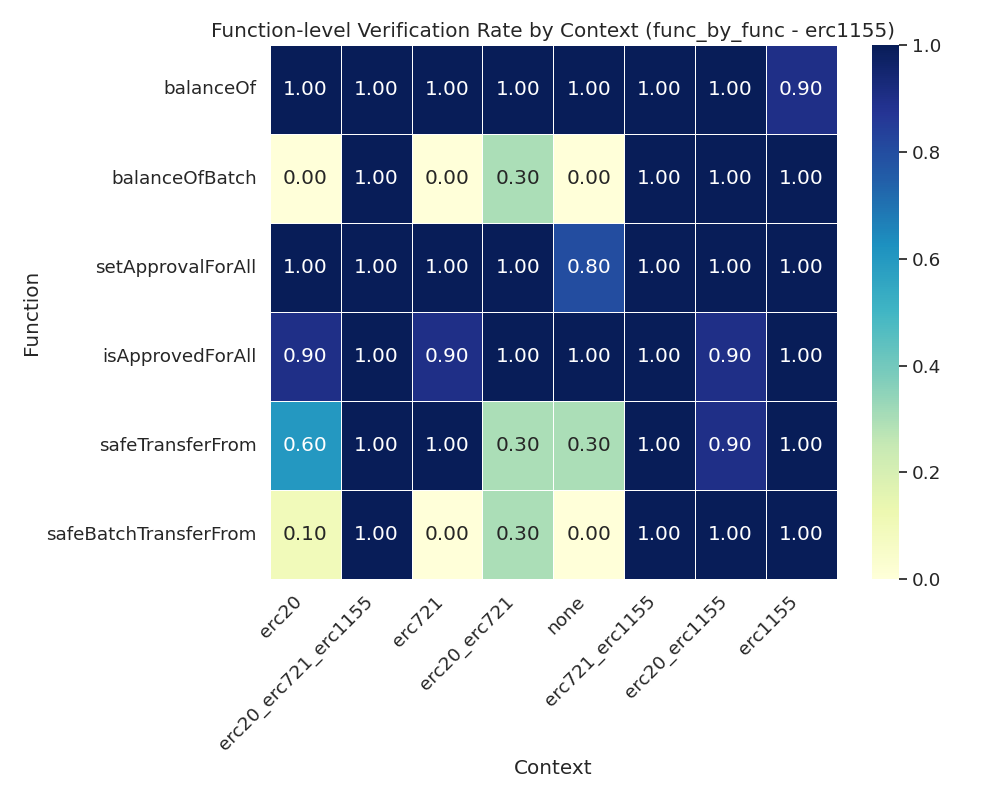

# Context Combination Verification Report (func_by_func - erc1155)

This table summarizes the performance of different context combinations for the assistant on the ERC1155 contract verification task, using the 'func_by_func' approach.

- **context**: The context combination used for the run.
- **verification_rate**: Fraction of runs that were successfully verified (higher is better).
- **min_success_iterations**: Minimum number of iterations needed to achieve a successful verification (lower is better).
- **max_iterations**: Maximum number of iterations used in any run.
- Other columns show averages and counts for each context.

| context | verification_rate | verified_count | total_runs | avg_time | avg_iterations | min_success_iterations | max_iterations |
| :--- | :--- | :--- | :--- | :--- | :--- | :--- | :--- |
| erc20_erc721_erc1155 | 100.00 | 10 | 10 | 178.51760411262512 | 8.7 | 7.0 | 13 |
| erc721_erc1155 | 100.00 | 10 | 10 | 174.54264001846315 | 8.6 | 7.0 | 13 |
| erc1155 | 90.00 | 9 | 10 | 164.22338471412658 | 8.1 | 6.0 | 16 |
| erc20_erc1155 | 80.00 | 8 | 10 | 213.80932102203369 | 10.6 | 6.0 | 18 |
| erc20_erc721 | 30.00 | 3 | 10 | 578.6858938217163 | 27.1 | 6.0 | 38 |
| erc20 | 0.00 | 0 | 10 | 711.0509649515152 | 31.4 | - | 42 |
| erc721 | 0.00 | 0 | 10 | 646.977520775795 | 29.6 | - | 38 |
| none | 0.00 | 0 | 10 | 788.6456270694732 | 33.1 | - | 42 |

## Function-level Verification Rate Heatmap

The heatmap below shows the verification rates for each function across different context combinations:

